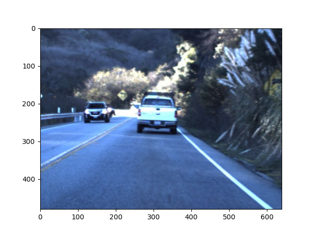
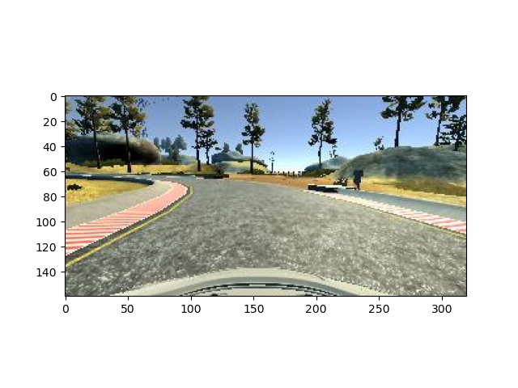
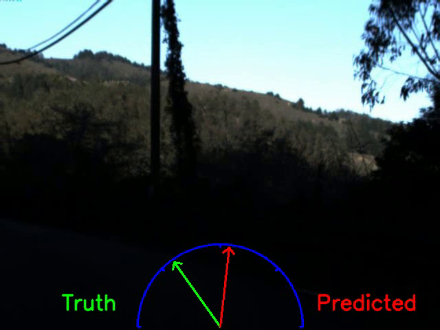
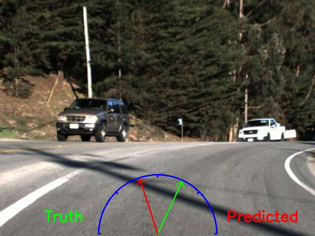
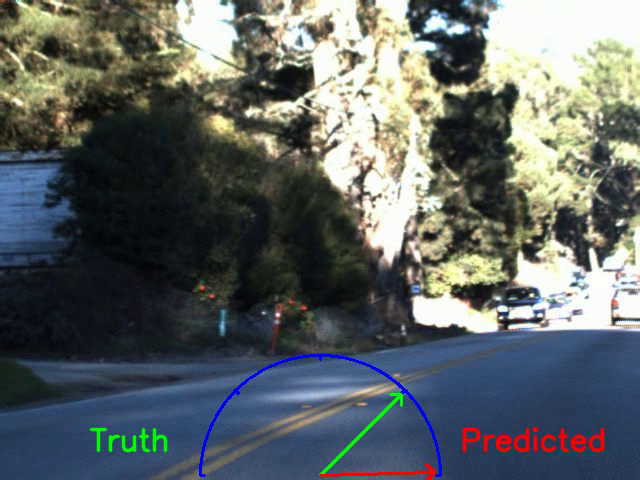

# Steering Angle Prediction Using ResNet-18
This was the final project completed as a group with Zachary Fisher and Anthony Nguyen for CIS 519 at UPenn.

The goal of this project was to use deep learning methods to accurately predict car steering angle. 

In phase 1 of the project, we began by evaluating various neural network architectures to predict the steering angle of a car using a real-world dataset provided by Udacity, Lyft, and Comma.ai. We found that a custom ResNet-18 architecture had the lowest test RMSE out of all the architectures studied and our score would have placed us in sixth place on the original Udacity leaderboard. We wanted to see how this architecture would actually behave on a car so we used Udacity’s car simulator to test it. In phase 2 of the project, various pre-processing methods were applied to generate eight models using the ResNet-18 architecture. Although we were able to successfully drive the car in the simulator, we found the ResNet-18 architecture may not be best suited for real time steering angle prediction due to its complexity.

For more details, please read our [final report](https://github.com/akhild555/steering_angle_prediction/blob/master/Final_Report_Summary_Slides.pdf). Additionally, please check out our summary video [here](https://vimeo.com/415693080).

## Datasets

The dataset we used for the first half of the project comes from Udacity and Lyft’s Perception Challenge, which can be found [here](https://github.com/udacity/self-driving-car/tree/master/datasets). The training data contains 101,398 images that were recorded using three RGB cameras (labeled left, center, and right) mounted on the vehicle and were time-stamped with the vehicle’s steering wheel angle, motor torque, GPS coordinates, and various sensor data. The test set contained 5614 images labeled with the steering angle.

The second half of the project used training data collected from [Udacity’s self-driving car simulator](https://github.com/udacity/self-driving-car-sim). The simulator came loaded with two tracks. Track 1 is a relative simple track with mostly simple curves and no hills. Track 2 has a lot more challenging curves and is hilly. Images of these tracks are show in Figure 2. Unfortunately, for unknown reasons, the simulator did not allow us to control the throttle during training data collection; we were forced to collect the steering angle data at full throttle. We drove around the tracks and collected a total of 126,712 images, and the corresponding steering angles, for each track.

Real-World Dataset          |  Udacity Simulator Dataset
:-------------------------:|:-------------------------:
        |  

## Phase 1: Real World Driving Steering Prediction

### Experiments and Results

We trained various neural network architectures to predict the steering angle of a car using a real-world dataset. The results are shown in the table below.

   

  

As can be seen, the custom ResNet-18 architecture yielded the lowest RMSE test error. The video below shows the predicted and ground truth steering angles overlayed on the test video.

   

  

The model performs well overall but fails at certain points during the video. One of them is due to poor lighting conditions. All these mistakes would have led to a crash if the model were steering a real car.

  
   
  

## Phase 2: Udacity Self-Driving Car Simulator

For phase 2 of the project, we wanted to understand how the ResNet-18 architecture would perform when actually driving a car in a simulated environment - we wanted to see if the car can correct itself with the accumulation of steering error.

### Experiments and Results

For phase 2, we used various pre-processing techniques to train models using the ResNet-18 architecture on training data collected on track 1 and track 2 in the simulator. Track 1 was a relatively easy track with a constant slopes and generally gentle curves. Track 2 was much more challenging with hills and drastic turns. The models trained are shown in the table below.

   

  

To test these models on track 1 we set the throttle to a constant value and allowed the model to steer the car. As shown in the plot, models 1-6 all failed to complete track 1, failing at a particularly challenging curve in the track. Since model 7 and 8 were trained on track 2,  which had a lot more curves with tighter radii, these models had no problem rounding the challenging curve in track 1 and completing the track.

   

  

In the gif below, model 3 was used to drive the car on track 1 in the opposite direction to which the training data was collected in order to simulate a test environment. This poor performance at this curve is representative of models 1-6, which were all trained using track 1 training data.

   

  

In the gif below, model 7 was used to drive the car on track 1. Model 7 was trained on data collected from track 2, which contains much tighter curves than track 1. As a result, model 7 is able to round the most challenging curve on this track and complete the track at an average speed of 6.8 mph. The car does sway a lot more on the track than with models trained on track 1. We believe this occurs since the lanes are much narrower in the training data collected in track 2, so the model forces the car to stay close to the lanes but tends to overcorrect.

   

  

## Conclusion

Although we were able to successfully drive the car, we believe the ResNet-18 architecture may not be best suited for real time steering angle prediction. The depth and complexity of the network may have been inhibiting the car from quickly correcting errors in steering angle. In future work, we would like to build models for throttle prediction to fully drive the car autonomously. Additionally, we want to use more complex self-driving car simulators that have multiple lanes, other cars and are generally more realistic. We would like to expand this work to autonomously drive a car in more challenging simulators, exploring more sophisticated techniques such as LSTM networks and reinforcement learning.

## Acknowledgement

We would like to acknowledge Udacity, Lyft, and Comma.ai for providing the real world dataset. We would also like to acknowledge Udacity for providing the self-driving car simulator and the accompanying code to test our models in the simulator. For a full list of references, please see our [final report](https://github.com/akhild555/steering_angle_prediction/blob/master/Final_Report_Summary_Slides.pdf).

